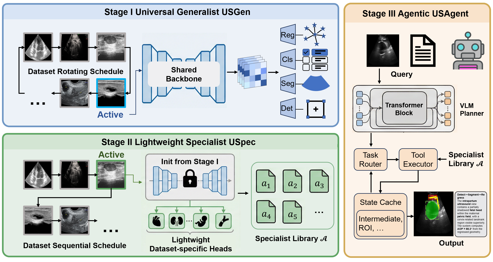

# Unified Ultrasound Intelligence Toward an End-to-End Agentic System


<p align="center">
  <b>Official PyTorch implementation of USTri</b><br/>
  A tri-stage ultrasound intelligence pipeline for <b>multi-organ</b>, <b>multi-task</b>, and <b>workflow-level</b> ultrasound analysis.
</p>

<p align="center">
  
</p>

---

## ✨ Highlights

- **Tri-stage design**: from a universal generalist (**USGen**) to lightweight specialists (**USpec**) and finally an agentic system (**USAgent**).
- **Unified task support**: segmentation, classification, detection, and regression in one framework.
- **Workflow-level inference**: compose trained specialists into interpretable, clinician-style pipelines.
- **Strong performance** on the FMC UIA validation benchmark across **27 datasets** and **4 task types**.

## 🧠 Overview

USTri is designed for real-world ultrasound intelligence, where data vary widely across organs, views, devices, and acquisition protocols.

It contains three stages:

- **Stage I — USGen**: a universal ultrasound generalist trained with dataset rotation to learn broad and transferable priors.
- **Stage II — USpec**: lightweight dataset-specific specialization with frozen backbone + compact heads.
- **Stage III — USAgent**: an agentic inference layer that routes tasks, calls specialists as tools, and renders structured reports.

## 📊 Main Results

On the **FMC UIA** unseen-domain validation set, **USpec** achieves the best overall performance reported in the paper:

| Task | Metric | USpec |
|---|---:|---:|
| Segmentation | DSC ↑ | **0.8980** |
| Segmentation | HD ↓ | **27.21** |
| Classification | AUC ↑ | **0.9352** |
| Classification | F1 ↑ | **0.8593** |
| Classification | MCC ↑ | **0.7675** |
| Detection | IoU ↑ | **0.8000** |
| Regression | MRE ↓ | **18.42** |


## 🚀 Getting Started

### 1) Clone the repository

```bash
git clone https://github.com/MacDunno/USTri.git
cd USTri
```

### 2) Install dependencies

Create your environment and install the packages used in the codebase:

```bash
pip install torch torchvision torchaudio
pip install albumentations opencv-python pandas numpy tqdm scikit-learn SimpleITK
pip install tensorboard segmentation-models-pytorch
```

### 3) Prepare the dataset

The training code expects the dataset under:

```text
data/train/
```

Please organize the data following the official **FMC UIA** format, including the CSV metadata files used by the provided scripts.

## 🏋️ Training

### Stage I — train the universal generalist

```bash
python train.py
```

### Stage II — finetune a specialist for one dataset

```bash
python train_phase2_single_dataset.py --task-id IUGC
```

You can replace `IUGC` with any supported task id defined in `model_factory.py`.

## 📈 Evaluation

Run evaluation on saved predictions with:

```bash
python evaluate.py
```

## 🔍 Supported Task Types

USTri supports four unified task categories:

- **Segmentation**
- **Classification**
- **Detection**
- **Regression**

Example task identifiers in the current codebase include:

- `IUGC`
- `FUGC`
- `fetal_femur`
- `breast_2cls`
- `breast_3cls`
- `fetal_plane_cls`
- `fetal_head_pos_cls`
- `fetal_sacral_pos_cls`

## 🧾 Citation

If you find this repository useful, please cite:

```bibtex
@inproceedings{ustri,
  title     = {Unified Ultrasound Intelligence Toward an End-to-End Agentic System},
  author    = {Ma, Chen and Li, Yunshu and Fu, Junhu and Liang, Shuyu and Wang, Yuanyuan and Guo, Yi},
  booktitle = {IEEE International Symposium on Biomedical Imaging (ISBI)},
  year      = {2026}
}

@article{tinyusfm,
  author={Ma, Chen and Jiao, Jing and Liang, Shuyu and Fu, Junhu and Wang, Qin and Li, Zeju and Wang, Yuanyuan and Guo, Yi},
  journal={IEEE Journal of Biomedical and Health Informatics}, 
  title={TinyUSFM: Towards Compact and Efficient Ultrasound Foundation Models}, 
  year={2026},
  pages={1-14},
  doi={10.1109/JBHI.2026.3678309}
}

@incollection{iugc,
  title={Unlabeled Data-Driven Fetal Landmark Detection in Intrapartum Ultrasound},
  author={Ma, Chen and Li, Yunshu and Guo, Bowen and Jiao, Jing and Huang, Yi and Wang, Yuanyuan and Guo, Yi},
  booktitle={Intrapartum Ultrasound Grand Challenge},
  pages={14--23},
  year={2025},
  publisher={Springer}
}
```
